<h1 align="center">Hi 👋, I'm Azhar Ansari</h1>

  

  

  

  

  

  

---

## 👨‍💻 About Me

I'm **Azhar Ansari**, a CSE student passionate about **Full Stack Development** and building practical web applications.

- 🚀 Learning and building real-world projects
- 💻 Interested in frontend and backend development
- 🌱 Improving my JavaScript and Node.js skills
- 🗄️ Learning databases and API development
- 🎯 Working towards becoming a professional Full Stack Developer
- 🤝 Open to internships, collaborations and hackathons

---

## 🛠️ Tech Stack

### 🌐 Frontend

  

### ⚙️ Backend

  

### 🗄️ Database

  

### 🔧 Tools

  

---

## 🚀 Featured Projects

### 🌐 Portfolio Website

A personal developer portfolio website showcasing my skills, projects, achievements and development journey.

**Tech:** HTML • CSS • JavaScript

---

### 📚 Current Affairs Quiz App

An interactive quiz application for practicing current affairs and improving general knowledge.

**Tech:** HTML • CSS • JavaScript • Node.js • Express.js

---

## 💻 More Projects Coming Soon

I'm continuously building and learning through practical projects.

👉 Check my repositories to explore my work.

---

# 📊 GitHub Stats

  <picture>
    <source media="(prefers-color-scheme: dark)" srcset="./assets/overview.dark.svg">
    <source media="(prefers-color-scheme: light)" srcset="./assets/overview.light.svg">
    
  </picture>

  <picture>
    <source media="(prefers-color-scheme: dark)" srcset="./assets/lifetime.dark.svg">
    <source media="(prefers-color-scheme: light)" srcset="./assets/lifetime.light.svg">
    
  </picture>

  

---

## 🔥 GitHub Streak

  <picture>
    <source media="(prefers-color-scheme: dark)" srcset="./assets/contributions.dark.svg">
    <source media="(prefers-color-scheme: light)" srcset="./assets/contributions.light.svg">
    
  </picture>

  🔥 Keep coding • Keep contributing • Keep improving

---

## 🏆 GitHub Trophies

  

  

---

## 📈 Contribution Graph

  <picture>
    <source media="(prefers-color-scheme: dark)" srcset="./assets/contributions.dark.svg">
    <source media="(prefers-color-scheme: light)" srcset="./assets/contributions.light.svg">
    
  </picture>

  <picture>
    <source media="(prefers-color-scheme: dark)" srcset="./assets/rhythm.dark.svg">
    <source media="(prefers-color-scheme: light)" srcset="./assets/rhythm.light.svg">
    
  </picture>

---

## 🏅 GitHub Profile Overview

  <picture>
    <source media="(prefers-color-scheme: dark)" srcset="./assets/overview.dark.svg">
    <source media="(prefers-color-scheme: light)" srcset="./assets/overview.light.svg">
    
  </picture>

---

## 🧑‍💻 Top Languages

  <picture>
    <source media="(prefers-color-scheme: dark)" srcset="./assets/languages.dark.svg">
    <source media="(prefers-color-scheme: light)" srcset="./assets/languages.light.svg">
    
  </picture>

  <picture>
    <source media="(prefers-color-scheme: dark)" srcset="./assets/composition.dark.svg">
    <source media="(prefers-color-scheme: light)" srcset="./assets/composition.light.svg">
    
  </picture>

---

## 🏆 Goals

- 🚀 Become a strong Full Stack Developer
- 💻 Build production-ready web applications
- 🌱 Learn advanced backend development
- ☁️ Explore cloud and deployment technologies
- 🤝 Contribute to open-source projects
- 🏆 Participate in hackathons and developer communities
- 📚 Keep learning new technologies

---

## 🌐 Connect With Me

  

  

  

  

  📧 <strong>Email:</strong> im5727170@gmail.com

---

<h3 align="center">🚀 Learn • Build • Improve • Repeat</h3>

  ⭐ Thanks for visiting my profile!

---

<!-- AUTO-PROJECTS-START -->
### [portfolio](https://github.com/CoderAzharAnsari62/portfolio)

No description available.

### [pdf-question-app](https://github.com/CoderAzharAnsari62/pdf-question-app)

No description available.

<!-- AUTO-PROJECTS-END -->
